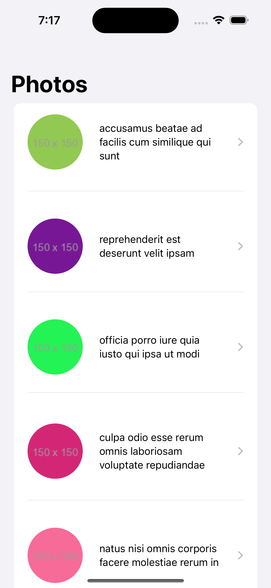
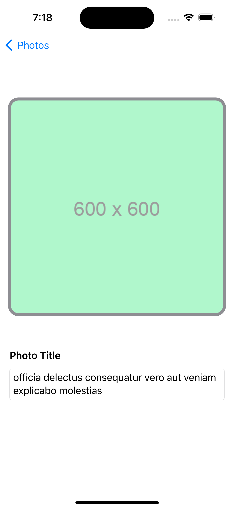
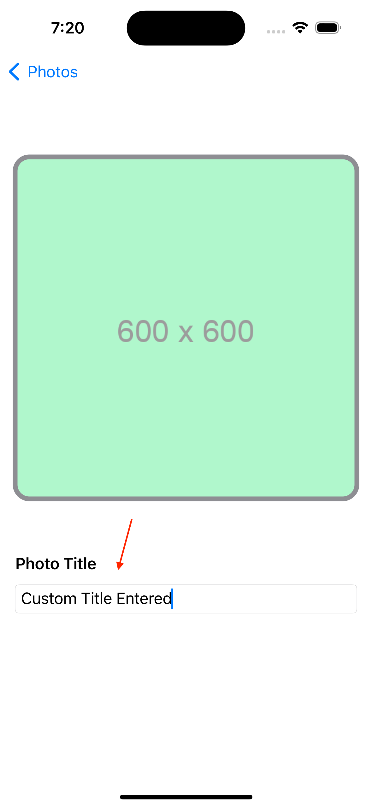
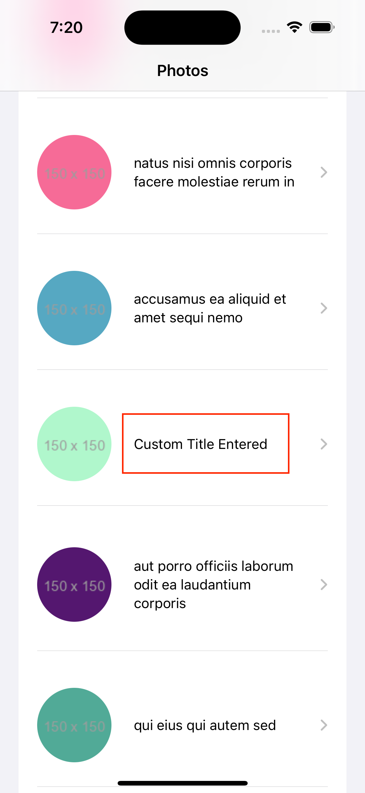

   

# PhotoViewer

## Introduction
PhotoViewer is an application to demonstrate the task of MVVM architecture integrated into SwiftUI App

So what is PhotoViewer exactly? PhotoViewer will pull down the photos from the [JsonPlaceHolder](https://jsonplaceholder.typicode.com/photos) and load it using the lazy pagination

It has a built with in memory caching using NSURLCache mechanism which will temporarily cache the image data once it's loaded and it will not fetch again until the app kill

## Architecture
App is powered by Combine, SwiftUI using the MVVM pattern. 

### Networking
Just configured the Generic Client which can be used across the app which can deserialize based on the Requestable Protocol Associated Type 

### Combine
As usual in most MVVM applications, Combine is used to bind input from the view to the viewmodel and bind data from the viewmodel to the view.

### Dependency Injection
Purpose of enabling the more testable business logic dependency has injected into the view model to help creating the mock service during the test case execution.

### Pagination
Configured the lazy loading of the photos in the list view with the configured threshold value once it's reached towards end of the list then it will start fetching the more photos if available 
As of now the total no of photos and the limits per page are configured within the app as constants

### Testing
Configured the mock json inside the unit test target which enables the view model logic to be validated and bring the coverage most out of it.

At this time, there are no real UITests present.
